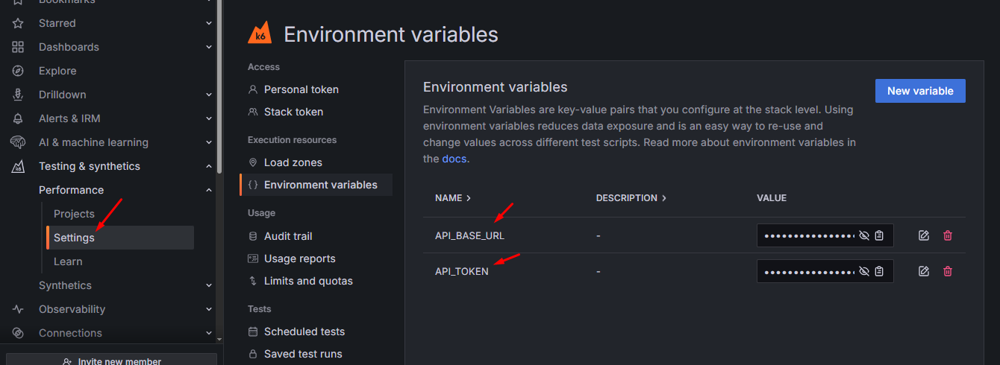

# Load Testing APIs with k6

This project provides a basic template for load testing APIs using the k6 Grafana framework with TypeScript.

## Prerequisites
- [k6](https://grafana.com/docs/k6/latest/set-up/install-k6/) must be installed on your system.
- Where to download [k6](https://github.com/grafana/k6/releases)
- [Node.js](https://nodejs.org/) and npm must be installed.

## Setup
1. Open a terminal and navigate to this directory.
2. Install the dependencies:
```bash
   npm install
```
Install @type/k6 in case there is none
```bash
   npm install --save-dev @types/k6
```
3. Environmental variable
```bash
   BASE_URL = "https://automationexercise.com/"
```
## Login to & test on Grafana Cloud

```bash
   k6 cloud login --token <token in settings>
```

Then add environment variables:

 
Run the project with:

```bash
   npm run build
   k6 cloud run dist/bundle.js
```
The report results will display on Projects tab within your Grafana Cloud Dashboard

## Run locally

Run command:
```bash
   npm run k6:local
```
The report should be shown in reports folder.